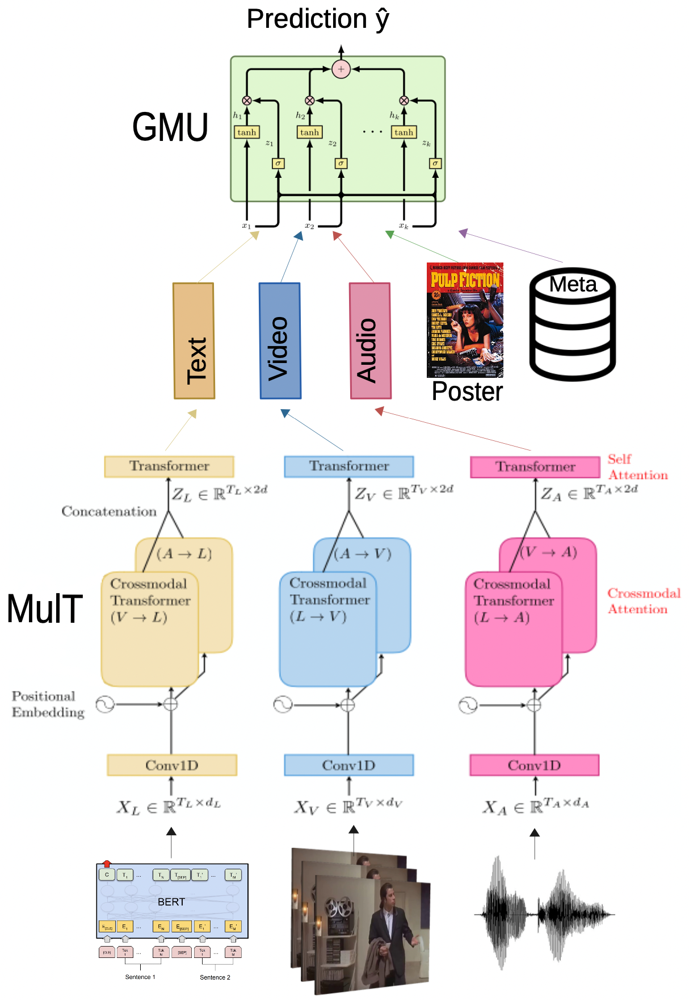

# Multimodal Deep Learning for movie genre classification (MulT-GMU)

The task is to predict the movie genres from movie trailers (video frames and audio spectrogram), movie plot (text), poster (image) and metadata by using the [Moviescope](https://www.cs.virginia.edu/~pc9za/research/moviescope.html) dataset. A new multimodal transformer architecture is proposed (MulT-GMU), which is an extension of MulT model (with dynamic modality fusion).

## Publications

This repo contains the code used for the publication of a paper at NAACL 2021 MAI Workshop: [Multimodal Weighted Fusion of Transformers for Movie Genre Classification
](https://aclanthology.org/2021.maiworkshop-1.1/) (MulT-GMU)

## Usage

Example of comman to run the training script

```
>> python mmbt/train.py --batch_sz 4 --gradient_accumulation_steps 32 --savedir /home/user/mmbt_experiments/model_save_mmtr --name moviescope_VideoTextPosterGMU_mmtr_model_run --data_path /home/user --task moviescope --task_type multilabel --model mmtrvpp --num_image_embeds 3 --patience 5 --dropout 0.1 --lr 5e-05 --warmup 0.1 --max_epochs 100 --seed 1 --num_heads 6 --orig_d_v 4096 --output_gates
```

## Mult-GMU architecture diagram



## Experiments mainly based on:

* [MulT](https://www.aclweb.org/anthology/P19-1656.pdf): Multimodal Transformer for Unaligned Multimodal Language Sequences.
* [MMBT](https://arxiv.org/abs/1909.02950): "Supervised Multimodal Bitransformers for Classifying Images and Text.
* [Moviescope Dataset](https://arxiv.org/abs/1908.03180): Moviescope: Large-scale Analysis of Movies using Multiple Modalities.
* [GMU](https://arxiv.org/abs/1702.01992) Gated Multimodal Units for Information Fusion by Arevalo et al.

## Versions

* python 3.7.6
* torch 1.5.1
* tokenizers 0.9.4
* transformers 4.2.2
* Pillow 7.0.0
